# Tugas - Bahasa Pemrograman

 Nama : Bangkit Akbar Anggara
 
 NIM : 312010148
 
 Kelas : TI.20.B.1

# Tugas - Pertemuan 5
 
Pada pertemuan 5 Bahasa Pemrograman, saya diberi tugas oleh Dosen untuk membuat Aplikasi Biodata dengan Python
  
  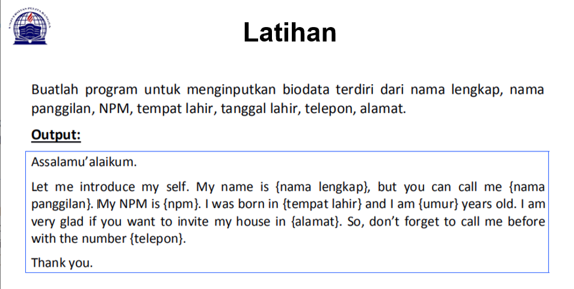
  
Saat ini saya akan menjelaskan hasil dari tugas tersebut berikut codingan syntaxnya:
  
  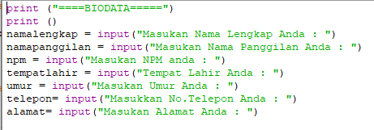
  
  > Berikut penjelasannya :
    
    print("====Biodata====")
  
  > Source code diatas berfungsi untuk mencetak hasil / output berupa "====Biodata====".
   
   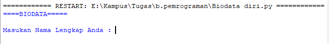
  
  > Untuk menampilkan output, saya menggunakan tanda petik dua didalam fungsi print("")
   
   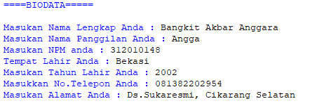

Untuk menghitung rumus umur saya menggunakan variable dob yaitu 2020 (Tahun Sekarang) dikurangi dengan Year of Birth, pada source code berikut :
  
  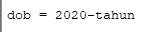
  
Langkah kali ini saya akan menampilkan output yang diminta oleh Dosen.
Outputnya, yaitu dengan syntax/source code berikut :
  
  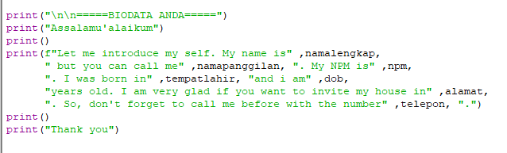
  
Keterangan :
   
  > Fungsi \n pada source code diatas adalah untuk memberi baris baru / enter / (newline).
   
  > Fungsi huruf f pada perintah print(f"...") adalah fungsi print atau bisa memudahkan programmer dalam mencetak statement dalam satu baris.
   
  > Sedangkan fungsi , pada output tersebut adalah untuk menampilkan hasil dari outputnya
     Hasil dari output tersebut seperti berikut :
   
   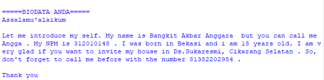
   
# Lab 1 - Pertemuan 6

Pada halaman ini saya diberikan tugas oleh Dosen yaitu mempelajari Operator Aritmatika menggunakan Bahasa Pemrograman Python.
  
  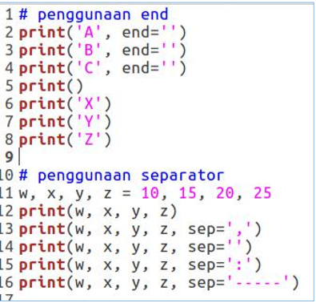
  
Saya akan menjelaskan tentang materi yang diberikan oleh Dosen.
  
  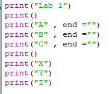
  
Penggunaan END Penggunaan end digunakan untuk menambahkan karakter yang dicetak di akhir baris. Secara default penggunaan end adalah untuk ganti baris.
Syntax dibawah ini digunakan untuk menampilkan output berupa string
    
    print("X")
    print("Y")
    print("Z")
 
Hasil dari source code di atas seperti gambar dibawah ini :
  
  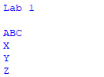

Penggunaan Separator Separator adalah pemisah yang berfungsi sebagai tanda pemisah antar objek yang dicetak. Defaultnya adalah tanda spasi.
  
 > Pendeklarasian beberapa variable beserta nilainya

     w,x,y,z=10,15,20,25
  
 > Menampilkan hasil dari variable tiap-tiap variable

     print(w,x,y,z)
  
 > Menampilkan hasil dari tiap-tiap variable dengan menggunakan pemisah , (koma)

     print(w,x,y,z,sep=",")
  
 > Menampilkan hasil dari tiap-tiap variable tanpa menggunakan pemisah

     print(w,x,y,z,sep="")
  
 > Menampilkan hasil dari tiap-tiap variable dengan menggunakan pemisah : (titik dua)

     print(w,x,y,z,sep=":")
  
 > Menampilkan hasil dari tiap-tiap variable dengan menggunakan pemisah -----

     print(w,x,y,z,sep="-----")
  
 > Hasil dari syntax / source code diatas adalah seperti berikut ini :
 
   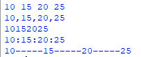
    
# Lab 1 bagian 2 - Pertemuan 6

String Format

String formatting atau pemformatan string memungkinkan kita menyuntikkan item kedalam string daripada kita mencoba menggabungkan string menggunakan koma atau string concatenation.

Penggunaan source code yang diberikan oleh dosen seperti berikut :

  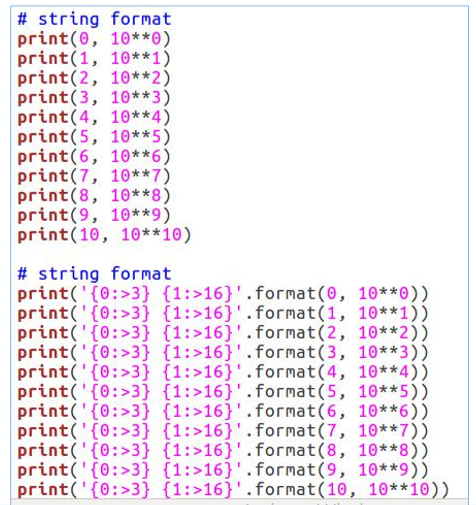

String Format 1

   Pada syntax / source code string format 1 akan menampilkan output berupa 2 outputan.
   Yang pertama (sebelah kiri) akan menampilkan angka Urut dari angka 0 hingga angka 10, sedangkan untuk sebelah kanan akan menampilkan Operasi Aritmatika Pangkat.
   Dengan ketentuan sebagai berikut, operasi pangkat dengan angka kiri sebagai pokok (Rumus : ** [bintang dua] )  
   Hasil dari syntax tersebut adalah 10 pangkat 0, hingga 10 pangkat 10. dengan output sebagai berikut :
    
   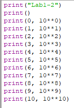
    
   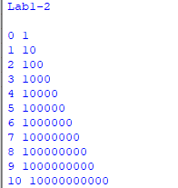

String Format 2
   
   Pada syntax atau source code string format 2 akan menampilkan output berupa 2 output'an juga (seperti String Format 1, yaitu kanan dan kiri)
   Dengan ketentuan sebagai berikut :
   Alignment, padding, dan precesion dengan .format() dalam kurung kurawal kita dapat menetapkan panjang bidang, rata kanan/kiri, parameter pembulatan dan banyak lagi.
   Secara Default, .format() menggunakan rata teks ke kiri, angka ke kanan. Kita dapat menggunakan opsi opsional <, ^, atau > untuk mengatur perataan kiri, tengah, atau kanan.
   Untuk hasil dari String Format 2 adalah :
    
   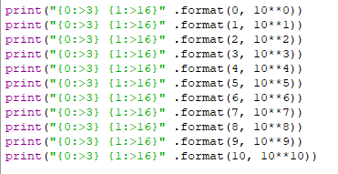
    
   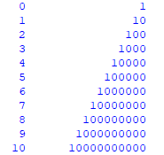

#  Lab 2 - Pertemuan 6 

Konversi Nilai Variable Untuk pembahasan terakhir, kali ini akan menyelesaikan tugas Lab 2 dari Dosen, yaitu Konversi Nilai Variable
Tugas yang diberikan oleh dosen adalah seperti gambar dibawah ini
  
  
  
Setelah saya menjalankan source code tersebut terdapat error, seperti gambar dibawah ini :
  
  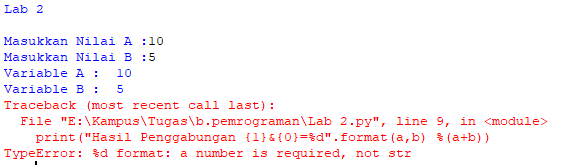
  
Nah, untuk kali ini kita akan membaca error yang telah terjadi.

TypeError: %d format: a number is required, not str

Pada error tersebut terbaca bahwa variable a adalah string, yang seharusnya dibaca oleh system adalah Number / Interger.
Bagaimana cara memperbaiki error tersebut?

Kita lihat pada baris ke 5 (di notifikasi terbaca bahwa error terletak pada baris ke 5), yaitu pada pemformatan .format() adalah interger, Sedangkan jika berupa string maka akan ada tanda petik dua ("..") pada pemformatan .format()

Kita akan terfokus pada variable a dan b.

Pada line 1 tertulis syntax : a=input("Masukkan Nilai A : ")

Sedangkan pada line 2 tertulis sytax : b=input("Masukkan Nilai B : ")

Untuk membuat inputan berupa interger/angka harus ditambahkan syntax int() pada format input(). Yang seharusnya ditulis adalah :

Kita akan ulangi semua sintax pada file ini seperti gambar di bawah ini:

 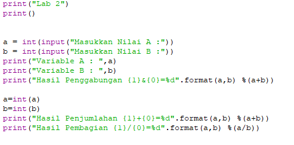
  
Kita akan coba lagi untuk run file tersebut, maka akan muncul seperti gambar dibawah ini :

 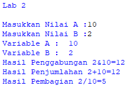
 
 Setelah semua file sudah berhasil, maka selesai sudah Tugas Pertemuan 6 - Bahasa Pemrograman kali ini.
 
 # =======Arigatou Gozaimasu========
 # Bangkit Akbar Anggara/312010148/TI.20.B.1
 # ======SEKIAN========
